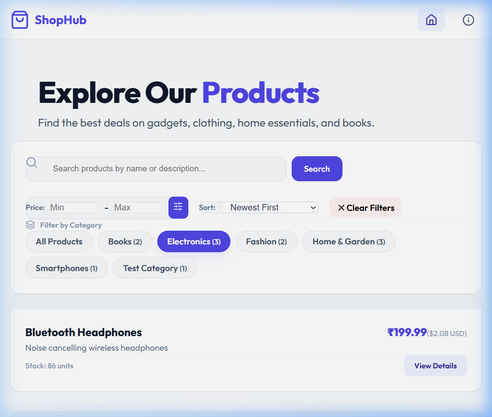
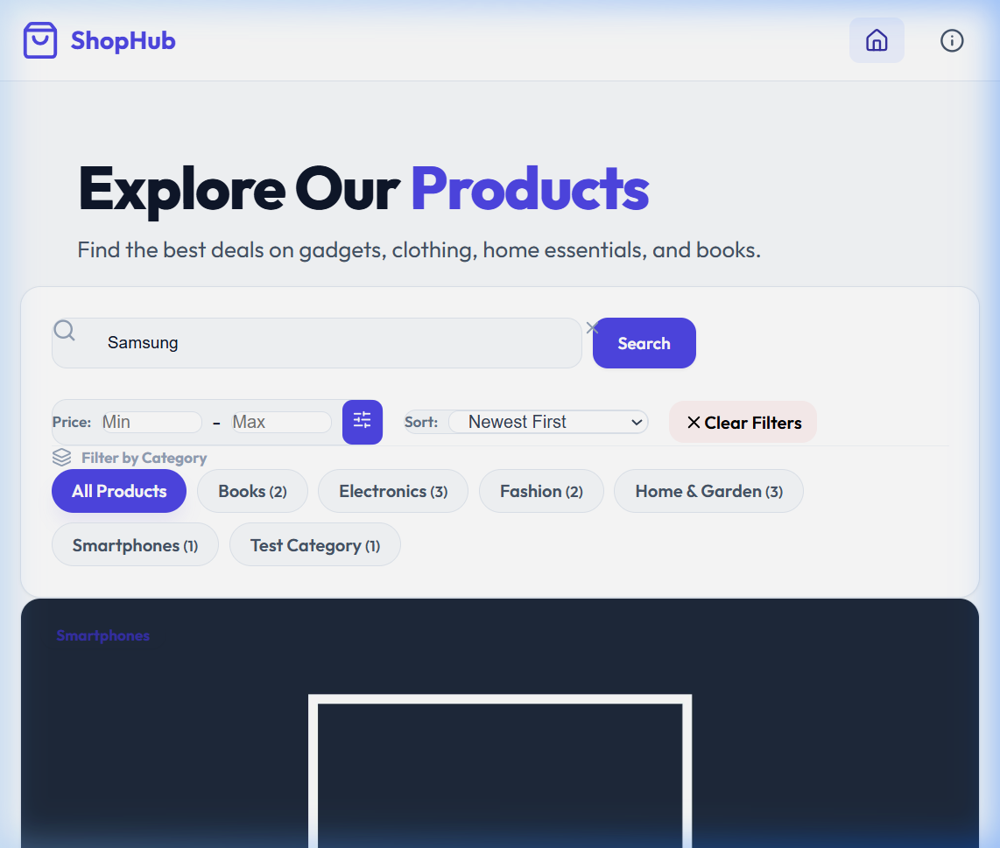
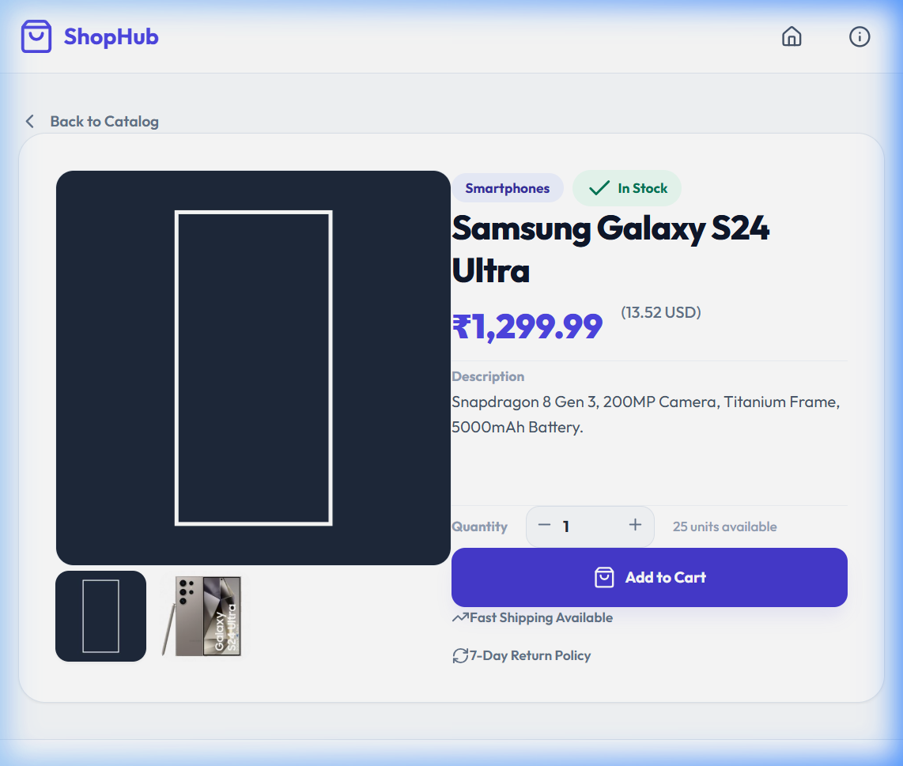

# 🚀 Week 17: Full-Stack E-commerce API Integration

## 📌 Project Overview
Welcome to **Week 17: Full-Stack API Integration**! This week, we focused on connecting our custom-built **Django REST Framework (DRF) backend** with our responsive **React (Vite) frontend**. 

The core objective was to establish secure Cross-Origin Resource Sharing (CORS) configurations, build a centralized Axios client on the frontend, and implement features like real-time search, price range filtering, category filtering, and sliding-window pagination syncing with URL parameters.

---

## 🛠 Project Features

### 1. CORS Configuration
- **Security Middleware**: Configured `django-cors-headers` middleware on the Django server.
- **Origins Whitelist**: Allowed requests from React client origins (`http://localhost:5173`) while denying unauthorized access.

### 2. Centralized Axios Instance
- **Axios Client**: Designed `axiosInstance.js` to manage the API root URL, defaults, and response timeouts for neat integration.

### 3. Product Catalog Grid
- **Dynamic Listing**: Renders products in a beautiful 3-column grid showcasing local currency formatting, stock counts, conversions, and category badges.
- **Pagination**: Implemented a sliding-window pagination bar with ellipsis pages that syncs parameters dynamically with URL parameters.

### 4. Interactive Filters
- **Live Search**: Full-text searching on product names and descriptions using DRF's `SearchFilter`.
- **Dynamic Category Tabs**: Category chips showing product counts fetched dynamically from `/api/categories/`.
- **Price Bounds Filter**: Constrains search results between user-inputted minimum and maximum prices.

### 5. Detailed Product Showcase
- **Specs View**: Detail page fetches individual specifications via `/api/products/:id/`.
- **Gallery support**: Renders multi-image grids dynamically, complete with checkout quantity controls and mock cart actions.

---

## 📑 Tech Stack
- **Backend Framework**: Django REST Framework (DRF)
- **Frontend Framework**: React 19
- **HTTP Client**: Axios
- **Routing**: React Router v6
- **Build Tool**: Vite
- **Styling**: Vanilla CSS (Tailwind-compatible classes)
- **Icons**: Lucide React
- **Database**: SQLite (Seeded with 12 mock catalog products)

---

## 📸 Screenshots

### Home Page / Product Catalog


### Live Search & Filters


### Product Detail View


---

## 💻 Setup & Deployment

### 1. Backend Setup (Django)
Navigate to the backend directory and install Python dependencies:
```bash
cd backend
pip install -r requirements.txt
python manage.py migrate
python manage.py runserver
```

### 2. Frontend Setup (React)
Navigate to the frontend directory, install npm packages, and run the dev server:
```bash
cd frontend
npm install
npm run dev
```

---

## 👤 Author
**Rohit Mohan**  
*Week 17 - Internship to Hire Excellence Program (I2HEP)*
