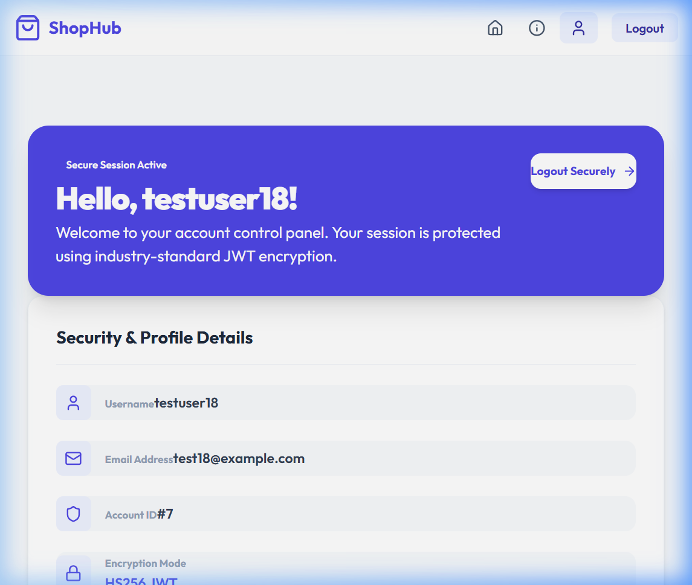

# 🚀 Week 18: JWT Auth in Frontend

## 📌 Project Overview
Welcome to **Week 18: JWT Auth in Frontend**! This week, we focused on implementing a robust, secure authentication system using **JSON Web Tokens (JWT)** on both our custom **Django REST Framework (DRF)** backend and our dynamic **React (Vite)** frontend.

The core objective was to securely store tokens (Access Token in memory, Refresh Token in localStorage), guard restricted components with protected routes, and integrate an Axios client interceptor to handle transparent background token refreshing.

---

## 🛠 Project Features

### 1. SimpleJWT Backend Configuration
- **Authentication Classes**: Updated DRF's authentication classes to prioritize `rest_framework_simplejwt.authentication.JWTAuthentication`.
- **Programmatic Token Issuance**: Updated registration and login endpoints to automatically generate and return both `access` and `refresh` tokens on success.
- **Refresh Endpoint**: Wired up simplejwt's `/api/token/refresh/` route to renew access tokens.

### 2. In-Memory & Local Token Storage
- **Access Token**: Stored strictly in-memory (React State) to mitigate Cross-Site Scripting (XSS) risks.
- **Refresh Token**: Saved in `localStorage` for cross-tab persistence and automatic session restoration.

### 3. Axios Interceptor Queue
- **Request Interceptor**: Automatically attaches the current `Authorization: Bearer <accessToken>` header to all outgoing API calls.
- **Response Interceptor**: Intercepts `401 Unauthorized` responses. It queries the `/api/token/refresh/` endpoint to fetch a new access token, updates memory, and retries the original failed request. If the refresh token is expired, it forces a logout.

### 4. Router Guard (`ProtectedRoute`)
- **Protected Layouts**: Restricts routes (like the Dashboard) from unauthorized visitors, automatically redirecting guests to the login page.
- **Sleek Loading Screen**: Renders a premium loading spinner while the session state is restored.

### 5. Premium Dashboard & Forms
- **Login & Register Views**: Designed beautiful card layout forms with input validation and real-time alert feedback.
- **Profile Dashboard**: Features a welcome banner, secure encryption badges, user credentials metadata, and fetches authenticated cart data dynamically from `/api/carts/` to prove JWT authorization is working.

---

## 📑 Tech Stack
- **Backend Framework**: Django REST Framework (DRF)
- **Authentication**: django-rest-framework-simplejwt
- **Frontend Framework**: React 19
- **HTTP Client**: Axios (with Interceptors)
- **Routing**: React Router v6
- **Build Tool**: Vite
- **Styling**: Vanilla CSS (Tailwind-compatible classes)
- **Icons**: Lucide React
- **Database**: SQLite

---

## 📸 Screenshots

### Verified Secure Dashboard


---

## 💻 Setup & Deployment

### 1. Backend Setup (Django)
Navigate to the backend directory, install python packages, migrate, and run the server:
```bash
cd backend
pip install -r requirements.txt
python manage.py migrate
python manage.py runserver
```

### 2. Frontend Setup (React)
Navigate to the frontend directory, install npm packages, and run the dev server:
```bash
cd frontend
npm install
npm run dev
```

---

## 👤 Author
**Rohit Mohan**  
*Week 18 - Internship to Hire Excellence Program (I2HEP)*
